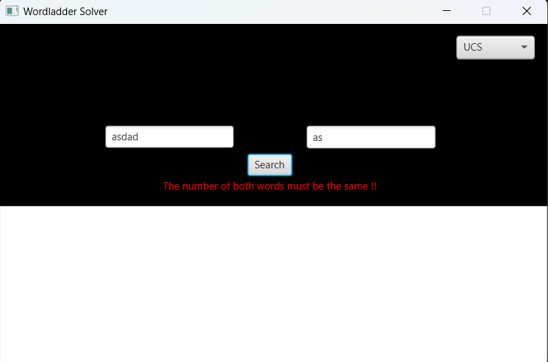
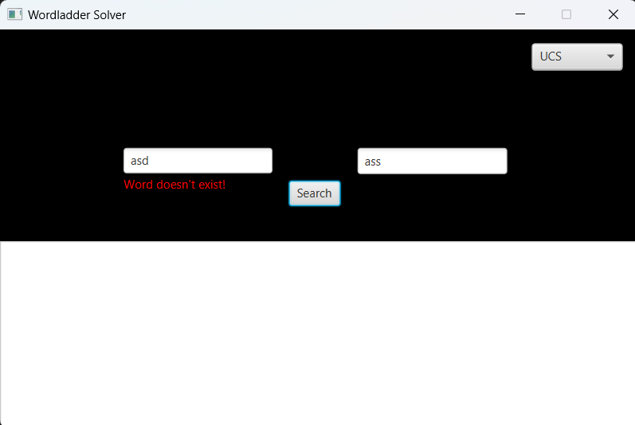
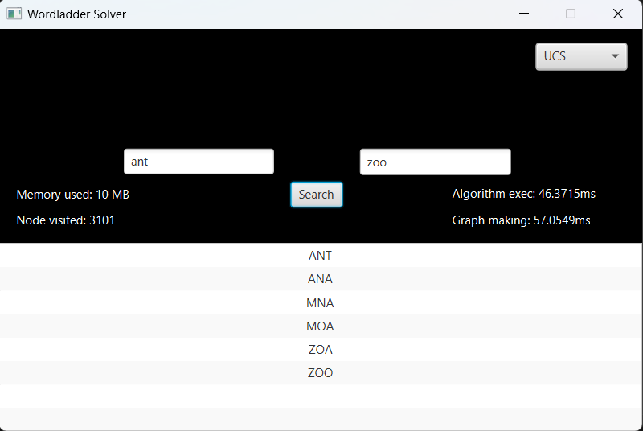

# Word Ladder Solver
> Program Word Ladder Solver adalah sebuah program yang bisa menemukan solusi permainan Word Ladder dengan pendekatan tiga algoritma: Uniform Cost Search(UCS), Greedy Best First Search(GBFS), dan A-star Search.

## Table of Contents
* [General Info](#general-information)
* [Technologies Used](#technologies-used)
* [Screenshots](#screenshots)
* [Setup](#setup)
* [Usage](#usage)
* [Features](#features)
* [Restrictions](#restriction)
* [Identity](#identity)
<!-- * [License](#license) -->

## General Information
Program Word Ladder Solver adalah sebuah program yang bisa menemukan solusi permainan Word Ladder dengan pendekatan tiga algoritma: Uniform Cost Search(UCS), Greedy Best First Search(GBFS), dan A-star Search.

## Technologies Used
- Scene builder
- Java jdk-22
- javafx-sdk-22.0.1

## Screenshots

<!-- If you have screenshots you'd like to share, include them here. -->

## Setup
Untuk menjalankan program ini diperlukan:
- JDK 11 atau yang lebih baru
(https://www.azul.com/downloads/?version=java-22&os=windows&package=jdk#zulu) untuk windows
(https://www.azul.com/downloads/?version=java-22&os=linux&package=jdk#zulu) untuk linux
- JavaFX SDK version 22.0.1
(https://gluonhq.com/products/javafx/) untuk windows dan linux (filter pada website untuk memilih)
- Langkah-langkah setup javafx bisa dilihat pada pranala: https://openjfx.io/openjfx-docs/

## Usage
Windows :
- Pastikan sedang di folder src
- compile:
`javac -d "../bin" --module-path "C:\Program Files\Java\javafx-sdk-22.0.1\lib" --add-modules javafx.controls,javafx.fxml App.java MainSceneController.java`
- Pastikan sedang di folder bin
- run program:
`java --module-path "C:\Program Files\Java\javafx-sdk-22.0.1\lib" --add-modules javafx.controls,javafx.fxml App`
- keterangan: "C:\Program Files\Java\javafx-sdk-22.0.1\lib" diganti dengan letak javafx-sdk/lib pada device pengguna
- Setelah program GUI berjalan dengan baik, masukkan input sesuai keinginan.

## Features
1. Validasi kata masukan.
2. Menampilkan memory usage.

## Restrictions
Folder word hanya memiliki kumpulan kata dengan jumlah huruf hingga 15.

## Identity
Abdullah Mubarak. 13522101. Mahasiswa tahun ke-2 Teknik Informatika ITB.